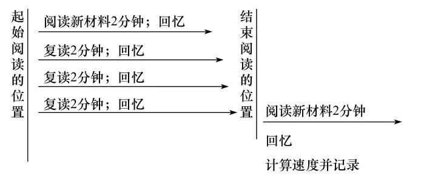
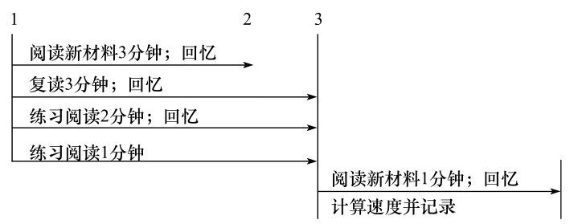
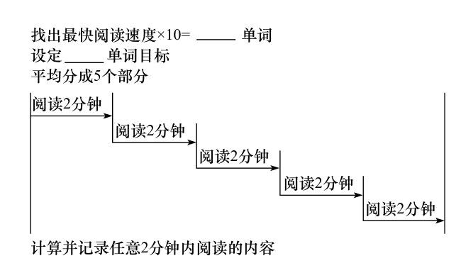
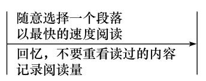

# 如何高效阅读

## 1.阅读速度的影响因素

### 1.1眼睛读取文字速度

1. 眼睛读取文字
2. 理解文字

### 1.2回读

回读分两类：

1. 有意识回读，比如：读完之后，感觉没有理解。
2. 无意识回读，比如：眼睛看错行了，或者眼睛下意识回读。

### 1.3默读

默读的是三个阶段：

1. 动嘴唇，不出声
2. 不动嘴唇，动喉咙
3. 心里读出声

### 1.4理解

### 1.5记忆力

## 2. 加速阅读

### 2.1 用手指

> 用手指或者鼠标辅助定位,在保证眼睛跟上速度同时，尽可能的的移动手指。

这样的方式可以锻炼眼睛读取文字的速度，同时消除无意识回读。

### 2.2 解决默读

如果在第一阶段：

* 读书时嘴咬个笔
* 读书时嘴放个哨子，知道哨子不响。

第二阶段：

* 刻意控制下很容易

### 提高理解力

通过下列方式练习：

### 为了目的而阅读

因为带有目的阅读可以让人放松，专注与获取答案，而不是担心遗漏内容。

所以在阅读的时候尽可能的预设目的。
